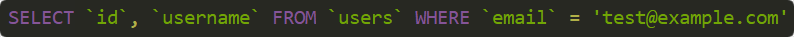

# SQL syntax highlight
> A simple and lightweight syntax highlighting library for SQL

[![NPM Version][npm-image]][npm-url]
[![Downloads Stats][npm-downloads]][npm-url]

## What's it all about?
SQL Highlight is a small package that highlights SQL queries. It can output to both the terminal with Unicode escape sequences, as well as to normal HTML

## Installation

Install via Yarn (recommended):
```bash
yarn add sql-highlight -D
```
Install via NPM:
```bash
npm install sql-highlight --save-dev
```

## Usage
Note that we're using ES6 import statements here. Usage with `require` works just as well.

**In its most basic form:**
```javascript
import Highlight from 'sql-highlight'
const highlighter = new Highlight()

console.log(highlighter.highlight("SELECT `id`, `username` FROM `users` WHERE `email` = 'test@example.com'"))
```

**Output:**



**HTML mode:**

```javascript
import Highlight from 'sql-highlight'
const highlighter = new Highlight({
  html: true
})

document.body.innerHTML += highlighter.highlight("SELECT `id`, `username` FROM `users` WHERE `email` = 'test@example.com'"))
```

**Output:**
```html
<span class="sql-hl-keyword">SELECT</span>
<span class="sql-hl-string">`id`</span>
<span class="sql-hl-special">,</span>
<span class="sql-hl-string">`username`</span>
<span class="sql-hl-keyword">FROM</span>
<span class="sql-hl-string">`users`</span>
<span class="sql-hl-keyword">WHERE</span>
<span class="sql-hl-string">`email`</span>
<span class="sql-hl-special">=</span>
<span class="sql-hl-string">'test@example.com'</span>
```

## Options
Options may be passed to the constructor while instantiating the `Highlighter` class.

| Option | Value | Default | Description |
| --- | --- | --- | --- |
| html | `boolean` | `false` | Set to true to render HTML instead of Unicode.
| classPrefix | `string` | `'sql-hl-'` | Prefix to prepend to classes for HTML span-tags. Is appended with entity name.
| colors | `Object` | _See below_* | What color codes to use for Unicode rendering.

\* `colors` option default value
```javascript
{
  keyword: '\x1b[35m',  // SQL reserved keywords
  function: '\x1b[31m', // Functions
  number: '\x1b[32m',   // Numbers
  string: '\x1b[32m',   // Strings
  special: '\x1b[33m',  // Special characters
  bracket: '\x1b[33m'   // Brackets (parentheses)
}
```

## Contributing

1. Fork it (<https://github.com/scriptcoded/sql-highlight/fork>)
2. Create your feature branch (`git checkout -b feature/fooBar`)
3. Commit your changes (`git commit -am 'Add some fooBar'`)
4. Push to the branch (`git push origin feature/fooBar`)
5. Create a new Pull Request

## Additional information

Malcolm Nihlén - malcolm.nihlen@gmail.com

Distributed under the MIT licence. See `LICENCE` for more information.

https://github.com/scriptcoded

## Disclaimer
This was initially a fork from https://github.com/pomahtuk/sequilize-highlight. The repo wasn't being
updated, NPM wasn't serving the latest version and there was a severe memory leak. Though the latest version now exists on NPM, issues still persist. This repo serves to address those problems, as well as providing a cleaner interface that's not bound to Sequelize.

[npm-image]: https://img.shields.io/npm/v/sql-highlight.svg
[npm-url]: https://npmjs.org/package/sql-highlight
[npm-downloads]: https://img.shields.io/npm/dm/sql-highlight.svg